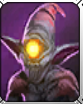

- Encounters Page made with Markdown Table Editor Plugin (right click on the node and select Markdown Table Editor). Press t+w to toggle wide Mode for best experience
  collapsed:: true
	- Morale: 3/12/2/0 (Number of Enemies that have to be left in order for the players to be allowed to roll for their surrender (once per turn. Character Initiative matters. The Character who attempts the roll has to be the active player in the Initiative)/Threshold that has to be rolled/Number of times the threshold has to be reached in order for the enemies to surrender/Number of times the threshold has already been reached) Or Unbreakable (Enemies will not give up)
	- |Icon|Name|Priority Target|Class|**Rank**/Reward|Always Cast|Cohesion|Difficulty|
	  |--|--|--|--|--|--|--|--|
	  |  |Goblin Grunt|Highest Current Physical Armour|Warrior; Physcial Damage|**Weak**[:br]Execute: 1[:br]Imprison: 200/250[:br]Recruit|  [[SKILL: Enrage]] |GM 14/**AI 10**|Easy|
	  |||||||||
- Numbercode
	- [001.01.01/02/03/04/05/06.01.01.01]
		- 001. Storypart
		- 01. Level
		- Permutations
			- 01. Scenery
			- 02. Character
			- 03. Encounter
			- 04. TRANSFER Generic Item (E.g. Gold)
			- 05. TRANSFER [Quest Item] has to be in brackets in game
			- 06. REWARD Generic Item (E.g Gold)
		- 01. WhichScenery or Character
			- A. GM Journal and Player Quest Journal Entries
				- 01. Permutation of the GM Journal
				- 00001. Player Quest Journal Entry Running Number throughout the whole game identifieying every single Questchain
					- 01 Player Quest Journal Runnning number for every entry of that Questchain
		- 01 WhichCard
		- 01 Which Decision
- ADDITIONALLY
	- ADDITIONALLY
		- Additional Check
- ALWAYS
	- Text
		- Decision1
		- Decision2
	- ALWAYS
		- This always happens when the vignette is read
- AND
  collapsed:: true
	- This is true AND
	- This is true THEN
		- This happens
- CHECK 01
	- CHECK 01
	  collapsed:: true
		- {This is for sorting the Checks}
	- CHECK 01
		- CHECK GM JOURNAL
			- [001.01.01.01.A.01 PermutationofEntry Specificdecisionname] TRUE/FALSE
- CHECK GM JOURNAL
	- CHECK GM JOURNAL
		- [001.01.01.01.A.01 PermutationofEntry Specificdecisionname]
- CHECK INVENTORY
  collapsed:: true
	- Character CHECK INVENTORY
		- ItemX TRUE/FALSE
- CHECK STATUS
	- Character CHECK STATUS
		- hashtagstatus TRUE/FALSE
- END DIALOGUE
  collapsed:: true
	- END DIALOGUE
	  collapsed:: true
		- (Players may turn their attention back to the game.)
- FALSE
  collapsed:: true
	- query FALSE
- FOLLOW PARTY
	- FOLLOW PARTY
		- Charactername TRUE/FALSE
- GAINSTATUS
	- Character GAINSTATUS
		- hashtagstatus
- IF
  collapsed:: true
	- IF This is true/false THEN
		- This happens
- IGNORE
	- IGNORE
		- This (e.G. Sticky)
			- Specific Thing
- IN ROOM
	- This Level IN ROOM
		- This Room
- IN LEVEL
	- This Item IN LEVEL
		- This Level COMMAND
- INSPIRATION
	- INSPIRATION
	  collapsed:: true
		- InspirationName
	- Rules
	  collapsed:: true
		- The party may choose two Backdrounds in the beginning of the game. The party gains one Inspiration Dice it has the corresponding background of the marked answer or skill check outcome. The party can have a maximum of 5 Inspiration Dices at any given time during the game. Every Inspiration Dice exceeding the limit will be wasted.
		- The GM gains one Inspiration Dice if the marked answer or skill check outcome occurs. The GM can have a maximum of 10 Inspiration Dices at any given time during the game. Every Inspiration Dice exceeding the limit will be wasted.
	- Players
		- #InspirationBarbarian
		- #InspirationHero
		- #InspirationJester
		- #InspirationMystic
		- #InspirationNoble
		- #InspirationOutlaw
		- #InspirationSoldier
		- #InspirationScholar
		- #InspirationVillain
	- GM
		- #InspirationGM
- LOAD MAP
  collapsed:: true
	- LOAD MAP
		- This Map
- LOOSESTATUS
	- Character LOOSESTATUS
		- hashtagstatus
- MOVE CHARACTER
	- MOVE CHARACTER
		- This Character TO
			- This Loacation
- **REWARD**
	- REWARD
		- Charactername [001.01.06.RunningnumberforRewardssamenumberforsamepermutaionofReward This Item]
- **SET ENCOUNTER**
	- SET ENCOUNTER
		- [001.01.03.01 Name] to Hostile/Neutral/Ally/Activated/Deactivated
- SET INGAME STATUS
	- SET INGAME STATUS
		- Charactername
			- Ingame Statusname for Duration in Turns
- SHOW MAP
	- SHOW MAP
		- This Map Ingame
- **SKILL CHECK**
	- [001.01.01.01.01.Decisionnumber Cha/Con/Dex/Int/Str/Wis/+Pers/+Item Numericvalue] Decision 1
	- SKILL CHECK
	  template:: twoskillcheck
	  collapsed:: true
		- Player has to roll a D20 and add the specified Modifier
			- IF Player rolls higher or equal than the required threshold THEN
			  collapsed:: true
				- This happens
			- IF Player rolls lower than the required threshold THEN
			  collapsed:: true
				- This happens
	- [001.01.01.01.Decisionnumber Cha/Con/Dex/Int/Str/Wis/+Pers/+Item Numericvalue/LowerNumericvalue] Decision 1
	- SKILL CHECK
	  template:: threeskillcheck
	  collapsed:: true
		- Player has to roll a D20 and add the specified Modifier
		  collapsed:: true
			- IF Player rolls higher or equal than the primary required threshold THEN
			  collapsed:: true
				- This happens
			- IF Player rolls lower than the primary required threshold but higher than the secondary required threshold THEN
			  collapsed:: true
				- This happens
			- IF Player rolls lower than the secondary required threshold THEN
			  collapsed:: true
				- This happens
- THEN
  collapsed:: true
	- IF This is true/false THEN
		- This happens
- TO
  collapsed:: true
	- [001.01.01.01.01 This Object] TO
		- This Inventory COMMAND
- To Vignette
  collapsed:: true
	- To Vignette [01.01.01.? This Vignette]
- **TRANSFER ITEM**
	- TRANSFER ITEM
		- [001.01.04.RunningnumberforGenericItemssamenumberforsamepermutationofGenericItem This Item] from Inventory TO
			- This Inventory COMMAND
	- TRANSFER ITEM
		- [001.01.05.RunningnumberforQuestItemssamenumberforsamepermutationofQuestItems This Item] from Inventory TO
			- This Inventory COMMAND
- TRUE
  collapsed:: true
	- query TRUE
- UPDATE Character
	- UPDATE Charactername
		- COMMAND
- UPDATE Gameworld
	- UPDATE Gameworld
		- COMMAND
- **UPDATE GM Journal**
	- UPDATE GM Journal
	  id:: 6682ac5d-7dfd-4f0b-8229-4a2a241f1234
		- [001.01.01.01.A.01 PermutationofEntry Specificdecisionname]
- **UPDATE Player Quest Journal**
	- UPDATE Player Quest Journal
		- [001.01.01.01.A.00001.01 A.QuestchainIdentificationnumber.PermutationofEntry Specificdecisionname]